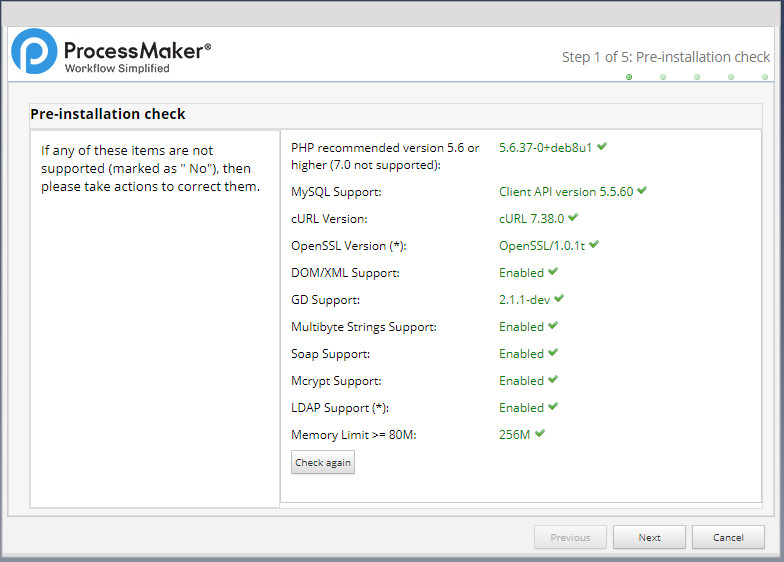
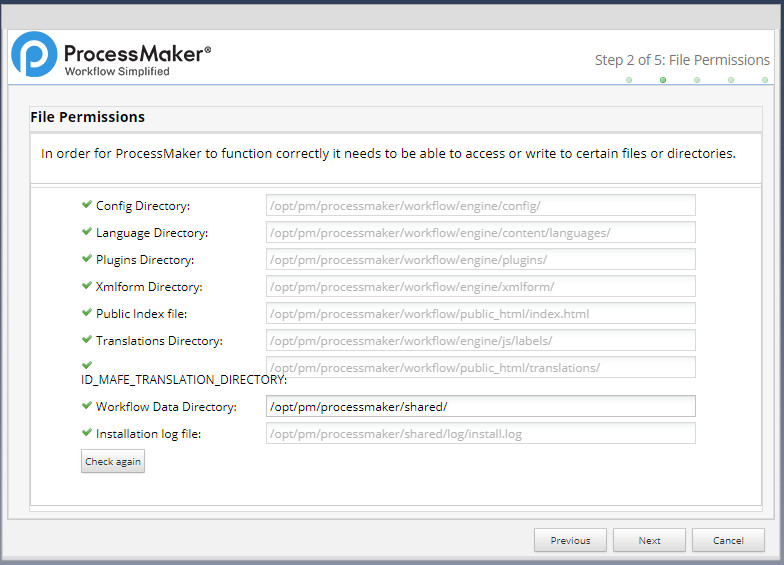
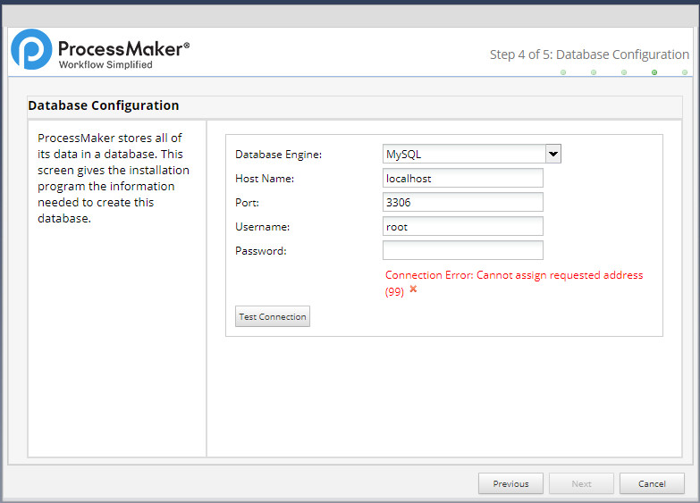
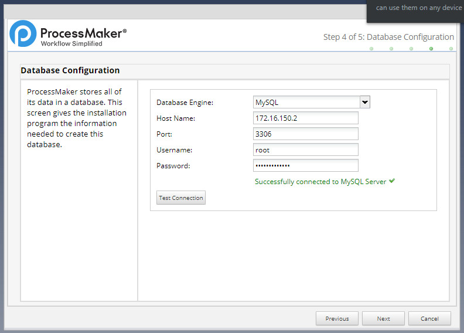
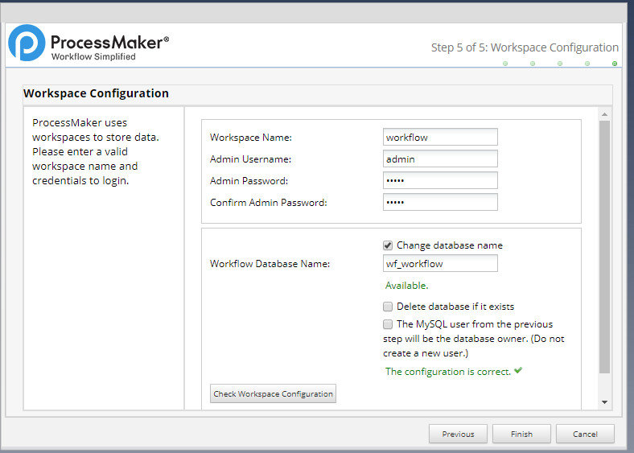
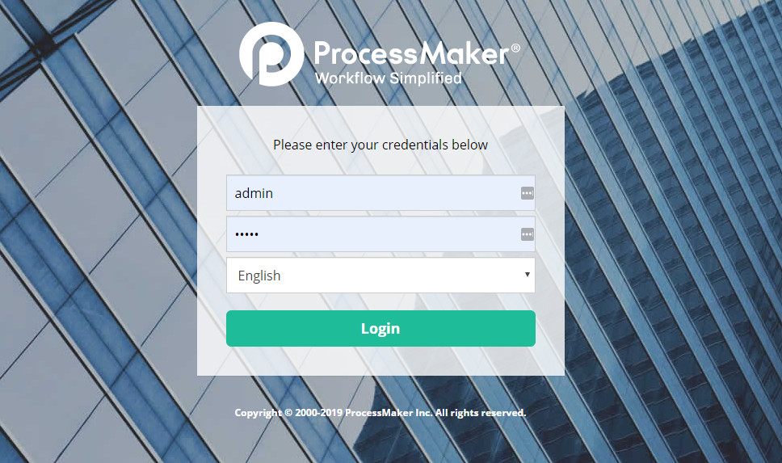

# ProcessMaker | BPM & Workflow Software Solution

"Enterprises looking for a full Workflow Content Automation Platform with the ability to automate complex workflows should evaluate ProcessMaker. The breadth of capabilities combined with a robust set of industry solutions makes them one to watch."

Process Maker are two docker images:-

- One is `Non-Commertial Open Source` Image and 
- Other is `Commercial Paid` Image.

> Docker Non-Commertial Open Source Image.
- https://hub.docker.com/r/eltercera/docker-processmaker

>  Docker Commertial Paid Image.
- https://hub.docker.com/r/processmaker/processmaker

# Installation Guideline

Generally Runing process with docker composer up in demon or background
    
    docker network prune
    docker-compose up -d

Open browser with following below issues:-

- https://localhost:8091






`Note` Database not connected properly, cause `Host Name` not found. So now, inspect into specific mysql container id or name like below and get `"IPAddress": "172.16.150.2"` from `Network Section`. 

    docker ps
    docker inspect [396319b4c448]

    Or,

    docker inspect [processmaker-docker_mysql_1]







Finally, down  docker composer process

    docker-compose -f down


# Docker Compose from, Custom docker composer file name

To run docker compose from file

    docker-compose docker-compose-ce.yml up
    docker-compose docker-compose-paid.yml up
    docker-compose "C:\Users\mesadhan\Desktop\processmaker-docker-paid.yml" up

To stop docker compose from file

```bash
  docker-compose -f docker-compose-ce.yml down
  docker-compose -f docker-compose-paid.yml down
```


# Exception Handeling

all remove all the unuse network

    docker network prune

show all the available networks
    
    docker network ls

show all the available networks
    
    docker network rm [name_network or id] 

